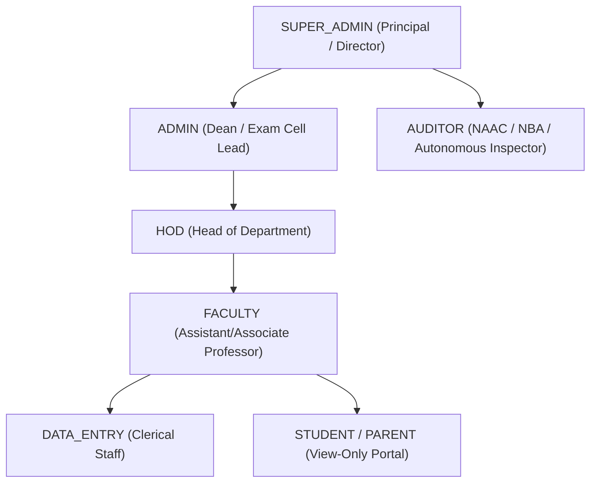

# NEC Portal — Architectural Brain & Technical Memory Bank (`barin.md` / `brain.md`)

> **Note:** This file is aliased with [`brain.md`](file:///d:/nec%20portal/NEC_PORTAL/brain.md). Both `brain.md` and `barin.md` provide the authoritative architectural memory bank for the NEC Portal.

---

# NEC Portal — Architectural Brain & Technical Memory Bank

> **Narasaraopeta Engineering College (Autonomous)**  
> **Repository:** `nec-portal` | **Revision:** Autonomous Academic ERP & Institutional Portal  
> **Last Synchronized:** September 2026

---

## 1. Executive Overview & Architecture

**NEC Portal** is a mission-critical, enterprise-grade academic operating system and public digital presence built for **Narasaraopeta Engineering College (Autonomous)**, Kotappakonda Road, Narasaraopet, AP.

The platform employs a **Dual-Persona Architecture**:
1. **Public Institutional Portal:** High-performance, SEO-optimized, accessible public-facing institution website showcasing academic programs, governance, NAAC/NBA accreditations, departments, faculty directories, campus infrastructure, virtual tours, and contact desks.
2. **Authenticated Enterprise ERP Portal:** A secured, role-based academic management workspace featuring Board of Studies (BoS) agenda/resolution management, Mid & External examination analytics, real-time student attendance risk tracking, guardian notification pipelines, faculty research & IPR hubs, placement intelligence, and central bulk data ingestion centers.

```
+-----------------------------------------------------------------------------------+
|                           NEC PORTAL DUAL ARCHITECTURE                             |
+-----------------------------------------------------------------------------------+
|                                                                                   |
|  [ Public Shell ]                                 [ Authenticated ERP Portal ]    |
|  - Hero & Statistics Counters                     - Executive Dashboard & Alerts  |
|  - Departments & Programs Hub                     - Board of Studies (BoS) Suite  |
|  - Faculty & Staff Directory                      - Mid Exam Analysis (CCDF)      |
|  - Leadership & Governance                        - Attendance Risk & SMS/Email   |
|  - Madame Showcase & Media                        - Placements & Career Records   |
|  - Virtual Tour & Contact Desk                    - Research, Patents & Grants    |
|                                                   - Central Bulk Data Center      |
|                                                                                   |
+-----------------------------------------+-----------------------------------------+
                                          |
                      +-------------------+-------------------+
                      |   Core Security & Identity Boundary   |
                      |  - Argon2id Password Hashing          |
                      |  - Firebase Auth (Google SSO)         |
                      |  - Resend Email OTP (HMAC Challenge)  |
                      |  - Role-Based Access Control (RBAC)   |
                      +-------------------+-------------------+
                                          |
        +---------------------------------+---------------------------------+
        |                                                                   |
+-------v-------------------------+               +-------------------------v-------+
|  Client State & Reactive Stores |               | Serverless Backend & Database   |
|  - src/data/portalStore.js      |               | - Vercel Serverless (/api/*)    |
|  - src/data/midExamStore.js     |               | - Drizzle ORM (32+ Schemas)     |
|  - src/data/masterData.js       |               | - Supabase PostgreSQL           |
|  - LocalStorage Persist Engine  |               | - Firebase Admin SDK            |
+---------------------------------+               +---------------------------------+
```

---

## 2. Technology Stack & Toolchain

| Layer | Technologies & Libraries | Key Responsibilities |
| :--- | :--- | :--- |
| **Runtime & Bundler** | React 19.2, Vite 8.2, Node.js (ESM) | Ultra-fast HMR, modular component tree, code splitting |
| **Styling & Design System** | Vanilla CSS3, Design Tokens (`design-system.css`) | Institutional Gold (`#D4AF37`) & Deep Navy (`#070F1E`) palette, `Cinzel`, `Outfit`, `Inter` |
| **Motion & Animation** | Framer Motion / Motion 13.1, Canvas Confetti | Smooth view transitions, institutional hero reveals, celebratory states |
| **Icons & Indicators** | Lucide React 1.33, Sonner Toasts | Standardized iconography across 30+ navigation items, notifications |
| **PDF Generation** | jsPDF 4.2 + jsPDF-AutoTable 5.0 | High-fidelity institutional PDF exports (BoS minutes, exam reports) |
| **Spreadsheet Processing** | SheetJS (`xlsx` 0.18) | Ingestion and export of academic mark sheets, attendance logs, rosters |
| **Data Validation** | Zod 4.4 | Runtime input validation, schema enforcement on imports and API payloads |
| **Authentication & IAM** | `@node-rs/argon2`, Firebase Auth, Resend | Multi-tenant auth, Google OAuth, salted password hashing, OTP via email |
| **ORM & Database** | Drizzle ORM 0.45, `postgres` 3.4, Supabase | Strict typed PostgreSQL schema, migrations, relational queries, audit trails |
| **Code Quality** | Oxlint 1.75 | Ultra-fast linter adhering to modern web standards |

---

## 3. Directory Layout & Codebase Structure

```
d:/nec portal/NEC_PORTAL/
|-- api/                               # Serverless API routes (Vercel Node runtime)
|   |-- auth/                          # Identity and session endpoints
|   |   |-- google/                    # Firebase Google OAuth linking & verification
|   |   |-- logout.js                  # Revokes session cookie and clears server session
|   |   |-- me.js                      # Authenticated identity resolver and role checker
|   |   |-- otp/                       # 2FA challenge issuance (send.js) & verification (verify.js)
|   |   |-- password/                  # Argon2id password setup, verification, and reset
|   |   `-- session/                   # Session heartbeat, renewal, and device tracking
|   |-- portal/                        # ERP data endpoints (portalDataService)
|   `-- telemetry/                     # Client error reporting and audit ingestion
|-- data/                              # Static seed data and JSON assets
|-- public/                            # Static public web assets, logos, college crests
|-- scripts/                           # Engineering automation, verification suites, and parsers
|   |-- export_canonical_bos_json.mjs  # BoS data canonical normalization
|   |-- ingest_event_media.mjs         # Drive and photo media optimization pipeline
|   |-- test_attendance_risk_suite.mjs # Unit and integration test for attendance risk engine
|   |-- test_bos_pdf_generation.mjs    # Validates jsPDF generation for Board of Studies
|   `-- test_research_integration_suite.mjs # Scopus/WoS parsing tests
|-- src/
|   |-- assets/                        # Component-scoped SVG icons and illustrations
|   |-- components/
|   |   |-- auth/                      # Dedicated authentication modals and OTP challenge inputs
|   |   |-- common/                    # Global search, error boundaries (Fatal, Auth, Module)
|   |   |-- portal/                    # Authenticated ERP modules
|   |   |   |-- analytics/             # Exam and institutional performance charts
|   |   |   |-- attendance/            # Attendance Risk Manager & Parent Contact Center
|   |   |   |-- bos/                   # Board of Studies meeting manager and resolutions
|   |   |   |-- bulk-data/             # Central Bulk Data Center (multi-entity Excel parser)
|   |   |   |-- dashboard/             # Floating sidebar, navigation categories, top header
|   |   |   |-- events/                # Workshops & Events with 1-to-1 section expansion
|   |   |   |-- faculty-achievements/  # Honors, awards, and FDP tracking
|   |   |   |-- fdps/                  # Faculty Development Programs organized/attended
|   |   |   |-- governance/            # Academic Council and Regulations (R20, R22, R24)
|   |   |   |-- iam/                   # User directory, permissions matrix, active sessions
|   |   |   |-- internships/           # Industry internship pipelines and student logs
|   |   |   |-- mous/                  # MoUs, corporate collaborations, and partner tracking
|   |   |   |-- nptel/                 # MOOC and NPTEL certifications
|   |   |   |-- patents/               # IPR, provisional filings, and granted patents
|   |   |   |-- placements/            # Campus placement stats, drive records, CTC distribution
|   |   |   |-- projects/              # Student capstone and research project repository
|   |   |   |-- publications/          # Journals, Scopus/WoS citations, conference proceedings
|   |   |   `-- research/              # Sponsored projects, research seed funding, grant metrics
|   |   |-- public/                    # Unauthenticated landing page components
|   |   |   |-- Header.jsx             # Institutional navigation, quick links, portal login CTA
|   |   |   |-- Hero.jsx               # Autonomous college banner, accreditations, admissions
|   |   |   |-- StatsCounter.jsx       # Placements, faculty count, campus area, NAAC metrics
|   |   |   |-- LeadershipSection.jsx  # Chairman, Secretary, and Principal messages
|   |   |   |-- GovernanceSection.jsx  # Governing body, statutory committees
|   |   |   |-- DepartmentsHub.jsx     # CSE, ECE, IT, EEE, MECH, CIVIL, AI/ML profiles
|   |   |   |-- FacultyDirectory.jsx   # Searchable public faculty database
|   |   |   |-- VirtualTour.jsx        # Campus gallery, drone perspectives, lab showcases
|   |   |   `-- ExamCellAndContact.jsx # Autonomous exam notifications and campus desk
|   |   `-- ui/                        # Low-level primitives: buttons, tables, badges, modals
|   |-- config/                        # App constants, environment resolvers
|   |-- data/                          # Master reactive state stores
|   |   |-- masterData.js              # Canonical academic data, departments, courses, programs
|   |   |-- midExamStore.js            # 60-student CCDF canonical exam store & 9-tab workflow
|   |   `-- portalStore.js             # Centralized ERP reactive store (7,800+ lines)
|   |-- lib/
|   |   |-- auth/                      # Session management, token verification, authFetch wrapper
|   |   |-- db/                        # Database connectivity & Drizzle ORM schema (`schema.ts`)
|   |   |-- email/                     # Resend client & institutional HTML email templates
|   |   `-- firebase/                  # Firebase client configuration (`client.ts`)
|   |-- server/                        # Server-side auth, crypto, and session middleware
|   |-- styles/
|   |   `-- design-system.css          # Design tokens, typography, CSS custom properties
|   |-- App.jsx                        # Root shell, error boundaries, router & layout switcher
|   |-- index.css                      # Global resets and root CSS definitions
|   `-- main.jsx                       # React 19 root mounting
|-- .env.example                       # Reference environment template
|-- package.json                       # Dependencies, scripts, and build commands
`-- vercel.json                        # Vercel deployment routes and serverless configuration
```

---

## 4. Identity & Access Management (IAM) / RBAC Architecture

### 4.1 Role Hierarchy & Permissions

The portal implements strict **Role-Based Access Control (RBAC)** across institutional domains:



* **SUPER_ADMIN:** Full unconstrained access across all departments, user provisioning, role promotion, audit trail viewing, and system settings.
* **ADMIN:** Operational management of exams, placements, institutional compliance, and cross-departmental data reviews.
* **HOD:** Departmental purview (e.g., CSE, ECE). Approves BoS minutes, manages departmental attendance alerts, reviews faculty achievements.
* **FACULTY:** Enters mid-exam scores, marks attendance, records personal publications, patents, and mentoring logs.
* **DATA_ENTRY:** Restricted upload capabilities in the Central Bulk Data Center without approval rights.
* **AUDITOR:** Read-only compliance portal for inspection and criterion validation.

### 4.2 Dual-Layer Authentication Flow

1. **Primary Authentication:**
   * **Password Mode:** Salted, multi-iteration password verification via `@node-rs/argon2` (Argon2id).
   * **Google OAuth Mode:** Verified institutional Google accounts (`@nec.edu.in`) via Firebase Client SDK, mapped to PostgreSQL `portal_users.firebase_uid`.
2. **Two-Factor Challenge (OTP):**
   * Configurable per-user or forced college-wide (`require_otp: true`).
   * Generates a cryptographically strong 6-digit numeric OTP.
   * Dispatched via **Resend Transactional Email Engine** to official email.
   * Stored as an HMAC-SHA256 hashed challenge in `otp_challenges` table with a 10-minute expiration window.
3. **Session Management:**
   * Signed HMAC-SHA256 session token stored in HttpOnly, SameSite cookies.
   * Configurable session TTL (Default: 12 hours; Remember Me: 7 days).
   * Active session tracking in `portal_sessions` capturing client IP, user agent, and device fingerprints.

---

## 5. Relational Database Schema (Drizzle ORM & PostgreSQL)

The backend schema defined in `src/lib/db/schema.ts` encompasses **32+ strongly-typed PostgreSQL tables**:

### 5.1 Identity & Governance Domain
* `roles` & `permissions` & `role_permissions`: Core RBAC tables with fine-grained granular capabilities (e.g., `bos.create`, `attendance.alert`).
* `departments`: Institutional units (Code, Name, Established Year, HOD Name, Intake Capacity).
* `portal_users`: Core user accounts supporting dual auth (Argon2id hash + Firebase UID), lock status, and profile details.
* `portal_sessions`: Multi-device tracking, state (`PENDING_OTP`, `VERIFIED`, `REVOKED`), expiration timestamps.
* `otp_challenges`: Hashed OTP tokens, attempt tracking (max 5 attempts), status enums.
* `audit_logs`: Append-only security audit trail recording actor ID, action, resource, client IP, and before/after JSON deltas.

### 5.2 Board of Studies (BoS) & Governance
* `bos_meetings`: Department-wise BoS meeting schedules, academic regulations (R20, R22, R24), agendas, resolutions, external expert attendees, and signed PDF artifacts.

### 5.3 Academic Analytics & Examinations
* `midExamStore` / Analysis Engine: Canonical 60-student dataset for **Cyber Crime & Digital Forensics (CCDF)**, tracking:
  * Assignment 1 & 2 scores (out of 5).
  * Mid-1 & Mid-2 Short Answer Questions (SAQ, out of 10).
  * Descriptive marks (out of 15).
  * Total & Percentage attainment.
  * Classification: **Advanced Learner** (>=80%), **Regular Learner** (50-79%), **Weak Learner** (<50%).
  * Remedial action tracking, remedial attendance registers, and re-test mark adjustments.

### 5.4 Student Development & Attendance Risk Suite
* `students`: Roll number, full name, department, semester, section, admission batch.
* `student_guardians`: Primary and secondary parent names, phone numbers, email addresses, communication preferences.
* `attendance_import_jobs` & `attendance_import_rows`: Bulk attendance log parsing from biometric/ERP sheets.
* `attendance_snapshots`: Aggregated student attendance percentages per academic cycle.
* `attendance_subject_records`: Subject-wise breakdowns highlighting risk thresholds (<75% standard, <65% medical condonation).
* `attendance_alerts` & `attendance_parent_contacts`: Real-time incident logs tracking guardian SMS/Email notices and parent response callbacks.

### 5.5 Research, Publications & Patents
* `publications`: Journal/conference titles, DOI, ISSN/ISBN, publication type, Scopus/Web of Science index status, citation count, Quartile ranking (Q1, Q2, Q3, Q4).
* `publication_authors`: Mapping faculty authors, primary author designations, and internal/external designations.
* `patents`: Patent application numbers, filing dates, publication dates, grant status, IPR category, commercialization metrics.
* `faculty_research_profiles`: Cumulative h-index, i10-index, Google Scholar profile links, Orchid IDs.
* `research_import_jobs`: Automated ingestion records from Scopus/WoS BibTeX or Excel dumps.

### 5.6 Academic Events & Media Hub
* `academic_events`: Workshops, FDPs, symposiums, guest lectures, hackathons.
* `academic_event_departments`: 1-to-1 mapping expanding multi-department collaborations into distinct section rosters.
* `academic_event_resource_persons`: External speakers, corporate trainers, honorariums, designation records.
* `bulk_media_jobs` & `bulk_media_items`: Image optimization and categorization pipeline (CDN URLs, WebP compression, aspect-ratio preservation).

---

## 6. Key Frontend Design System & Tokens

Defined in `src/styles/design-system.css`, the styling guidelines enforce an **Institutional White & Navy Theme**:

* **Color Palette:**
  * Primary Deep Navy: `--color-primary-950` (`#040811`), `--color-primary-900` (`#070F1E`), `--color-primary-600` (`#1E3E62`)
  * Institutional Imperial Gold: `--color-gold-600` (`#D4AF37`), `--color-gold-500` (`#F1C40F`), `--color-gold-100` (`#FCF5DC`)
  * Surface Backgrounds: Clean White (`#FFFFFF`), Subtle Gray (`#F8FAFC`), Card Border (`#E2E8F0`)
  * Functional Status: Success (`#10B981`), Warning (`#F59E0B`), Danger (`#EF4444`), Info (`#0EA5E9`)
* **Typography:**
  * Serif / Heritage: `'Cinzel', serif` (Instituted for collegiate branding, headers, crest titles).
  * Display / Headings: `'Outfit', sans-serif` (Modern, readable, high-impact titles).
  * Body & Monospace: `'Inter', sans-serif` (Optimal legibility for data-dense academic grids).
* **Geometry Tokens:**
  * `--portal-sidebar-expanded`: `310px`
  * `--portal-sidebar-collapsed`: `82px`
  * `--portal-shell-x`: `14px`, `--portal-shell-y`: `18px`

---

## 7. Environment Configuration Reference (`.env.example`)

| Variable | Purpose | Classification |
| :--- | :--- | :--- |
| `VITE_FIREBASE_API_KEY` | Public Firebase API key for client OAuth | Client-safe (Vite bundled) |
| `VITE_FIREBASE_AUTH_DOMAIN` | Firebase Authentication domain | Client-safe |
| `VITE_FIREBASE_PROJECT_ID` | Project ID (`nec-college-b964a`) | Client-safe |
| `RESEND_API_KEY` | Transactional email API key for OTP delivery | **Secret** (Serverless only) |
| `AUTH_EMAIL_FROM` | Verified sender address (e.g. `security@codeaxisapply.xyz`) | Server-side config |
| `SESSION_HMAC_SECRET` | Secret key for signing session tokens | **Secret** |
| `OTP_HMAC_SECRET` | Secret key for hashing one-time passwords | **Secret** |
| `DATABASE_URL` | PostgreSQL connection string for Drizzle ORM | **Secret** |
| `SUPABASE_SERVICE_ROLE_KEY` | Admin key for Supabase row-level security bypass | **Secret** |
| `SCOPUS_API_KEY` / `WOS_API_KEY` | Optional API keys for citation sync | **Secret** |

---

## 8. Development & Operational Workflows

### 8.1 Common Scripts
```bash
# Start local development server (Vite HMR on port 5173)
npm run dev

# Build production bundle for deployment
npm run build

# Run Oxlint across entire codebase
npm run lint

# Ingest and optimize event media
npm run ingest:event-media
```

### 8.2 Testing & Verification Suites
Run verification tests directly with Node:
```bash
# Verify Mid-Exam 9-tab workflow and calculations
node scripts/test_central_bulk_data_center.mjs

# Verify Attendance Risk engine and parent alerts
node scripts/test_attendance_risk_suite.mjs

# Verify Board of Studies PDF generation and compliance layout
node scripts/test_bos_pdf_generation.mjs

# Verify Research, Publications, and Scopus integration
node scripts/test_research_integration_suite.mjs
```

---

## 9. Engineering Directives & Maintenance Guidelines

1. **Documentation & Memory Bank Integrity:** Whenever updating data structures in `portalStore.js`, `midExamStore.js`, or `schema.ts`, keep this `brain.md` document synchronized.
2. **Error Boundary Isolation:** Never remove or bypass `RootFatalErrorBoundary`, `AuthErrorBoundary`, or `ModuleErrorBoundary` in `src/App.jsx`. A failure in a single experimental sub-module (e.g., BoS parser) must never take down the institutional portal shell.
3. **Canonical Data Inviolability:** The 60-student CCDF dataset in `src/data/midExamStore.js` and master courses in `src/data/masterData.js` serve as golden references for institutional demonstrations and automated compliance audits.
4. **Institutional Aesthetics:** Always honor the white institutional theme with gold/navy accents. Avoid unapproved neon or generic color palettes. Always utilize predefined design tokens from `src/styles/design-system.css`.
